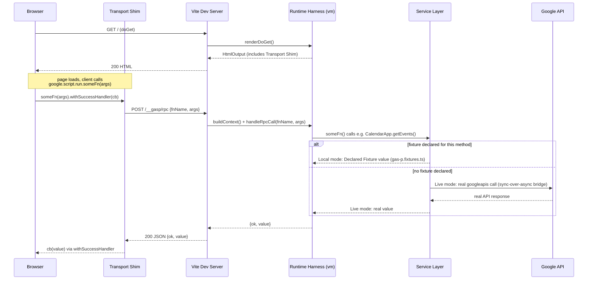

# gas-p

[](https://www.npmjs.com/package/@evinle/gas-p)

A local development runtime for Google Apps Script (GAS) web apps. Run your real `.gs`/`.ts` server code and real `index.html` frontend together with `vite dev` — hot reload, real Google API calls, no `clasp push` round-trip to see a change, and no imports/`await`/coupling added to your GAS source; `google.script.run` keeps working exactly as it does in production.

- [How it works](#how-it-works)
- [Quick start](#quick-start)
- [Configuration reference](#configuration-reference)
  - [`gasPVitePlugin(options)`](#gaspviteplugin-options--vite-plugin-options)
  - [`gas-p.config.ts`](#gas-pconfigts--optional-for-options-you-dont-want-to-repeat-in-every-plugin-call)
  - [`gas-p.fixtures.ts`](#gas-pfixturests--optional-declared-fixtures-for-local-mode)
  - [CLI](#cli)
- [How auth works](#how-auth-works)
- [Services implemented](#services-implemented)
- [Known prod/dev parity gaps](#known-proddev-parity-gaps)
- [Contributing](#contributing)
- [License](#license)

## How it works

Three pieces hand a `google.script.run` call off to your real source and back: the **Transport Shim** (client-side drop-in for `google.script.run`), the **Runtime Harness** (runs your real `.gs`/`.js`/bundled `.ts` source in a fresh Node `vm` context per request), and the **Service Layer** (resolves GAS globals like `CalendarApp` to Local mode or Live mode).



Live mode calls are real Google API calls via `googleapis`, bridged synchronously via a subprocess-per-call — every call, read or write, is an immediate round-trip, no caching, no write queue (see [ADR 0001](docs/adr/0001-immediate-live-semantics-no-write-queue.md)).

## Quick start

```bash
npm install --save-dev @evinle/gas-p
```

Add the Vite plugin to your project's `vite.config.ts`:

```ts
import { defineConfig } from "vite";
import { fileURLToPath } from "url";
import { gasPVitePlugin } from "@evinle/gas-p/vite";

const srcDir = fileURLToPath(new URL(".", import.meta.url));

export default defineConfig({
  plugins: [
    gasPVitePlugin({
      srcDir,
      entry: "Code.ts", // omit if your source is plain .gs/.js, no bundling needed
      htmlDir: "client", // omit if your .html files live alongside srcDir
      devResourceIds: {
        // Live mode refuses to touch any resource ID not declared here —
        // a copy-pasted production calendar/spreadsheet ID can't get
        // silently mutated during local dev.
        CalendarApp: ["primary"],
      },
    }),
  ],
});
```

Install the transport shim in your `index.html` (or client entry), before any code calls `google.script.run`:

```html
<script type="module">
  import { installTransportShim } from "@evinle/gas-p/client";
  installTransportShim({ endpoint: "/__gasp/rpc" });
</script>
```

Create an OAuth client (one-time, per Google Cloud project) — see [How auth works](#how-auth-works) — save it as `~/.gas-p/client_secret.json`, then authenticate:

```bash
npx gas-p auth --manifest appsscript.json
```

Run it:

```bash
npx vite dev
```

Your app is now running locally, calling real Google APIs through your own credentials.

## Configuration reference

### `gasPVitePlugin(options)` — Vite plugin options

| Option | Default | Purpose |
|---|---|---|
| `srcDir` | `gas-p.config.ts`'s `srcDir`, resolved | Where your `.gs`/`.js`/entry `.ts` source and `appsscript.json` live. Required unless a `gas-p.config.ts` supplies it |
| `entry` | `gas-p.config.ts`'s `entry`, if any | A `.ts` file to bundle live via Vite before running (real imports across files). Omit for plain `.gs`/`.js` — no bundling, files are run as-is |
| `htmlDir` | `srcDir` | Where `HtmlService.createTemplateFromFile()`/`createHtmlOutputFromFile()` read `.html` files from, if different from `srcDir` (e.g. a bundled `.ts` entry whose HTML lives in a separate client directory) |
| `endpoint` | `/__gasp/rpc` | The RPC path the transport shim POSTs to — must match the `endpoint` passed to `installTransportShim()` |
| `page` | `/` | The path `doGet()`'s rendered HTML is served on |
| `configFile` | `<root>/gas-p.config.ts` | Path to `gas-p.config.ts`, only consulted when `srcDir` isn't passed explicitly |
| `credentialsPath` | `~/.gas-p/credentials.json` | Where the OAuth token from `gas-p auth` is read from |
| `clientSecretPath` | `~/.gas-p/client_secret.json` | Where your OAuth client (`client_secret.json`) is read from |
| `devResourceIds` | `gas-p.config.ts`'s `devResourceIds`, if any | Allowlist of Google resource IDs Live mode may touch, keyed by GAS global service name: `{ CalendarApp: ['primary', '<calendar-id>'] }` |
| `fixturesFile` | `<root>/gas-p.fixtures.ts` | Path to `gas-p.fixtures.ts` (see below), read fresh on every request |

### `gas-p.config.ts` — optional, for options you don't want to repeat in every plugin call

```ts
export default {
  srcDir: "./src",          // required
  entry: "Code.ts",         // optional
  devResourceIds: { CalendarApp: ["primary"] }, // optional
  port: 5173,               // optional — informational; Vite's own server.port is what actually controls the port
};
```

`gasPVitePlugin` only reads this file when `srcDir` isn't passed as an explicit plugin option — explicit options always win.

### `gas-p.fixtures.ts` — optional, Declared Fixtures for Local mode

```ts
import { defineGasPFixtures } from "@evinle/gas-p/fixtures";

export default defineGasPFixtures({
  CalendarApp: {
    getDefaultCalendar: () => ({
      getEvents: (start, end) => [
        {
          getTitle: () => "Standup",
          getStartTime: () => new Date("2026-02-02T10:00:00Z"),
          getEndTime: () => new Date("2026-02-02T11:00:00Z"),
        },
      ],
    }),
  },
});
```

Each top-level key is a fixture-eligible GAS service name; each method's value is either a static return value or a function of the real method's own arguments — either form must be synchronous, since it runs inside the same `vm.Context` as your GAS source. Declaring a fixture switches that one method to **Local mode**: the Service Layer answers from the fixture instead of calling Google, no credentials or dev resources needed. Any method left undeclared still falls through to **Live mode** exactly as before. Like `.gs`/`.js` source, `gas-p.fixtures.ts` is read fresh on every request — no dev-server restart needed to see an edit.

Fixtures aren't limited to the handful of services in [Services implemented](#services-implemented) below — they apply to any fixture-eligible service, including stub-only ones like `SpreadsheetApp` or `GmailApp` that otherwise throw `GasPNotImplementedError` for every method. That makes fixtures the way to unblock development against a service gas-p hasn't built a real shim for yet, not just an override for `CalendarApp`/`Session`.

Not fixture-eligible: `Utilities`, `CacheService`, `UrlFetchApp`, `Logger`, `HtmlService`, `PropertiesService` — these are already fully local, so there's nothing for a fixture to stand in for.

### CLI

```
gas-p auth [options]

Options:
  --manifest <path>  Path to appsscript.json (default: "<cwd>/appsscript.json")
```

## How auth works

`gas-p auth` is a one-time (per machine, per OAuth-scope-set) step, separate from `clasp login` — gas-p owns its own OAuth2 client so it can request whatever scopes your `appsscript.json` declares.

1. **Create an OAuth client** (once, per Google Cloud project): in [Google Cloud Console](https://console.cloud.google.com/) → APIs & Services → Credentials → **Create Credentials → OAuth client ID** → Application type **Desktop app**. Download the resulting JSON and save it as `~/.gas-p/client_secret.json` (or point `clientSecretPath`/`--manifest`-adjacent config at a different path). It must have the shape Google downloads it in — an `installed: { client_id, client_secret }` object.
2. **Run `gas-p auth --manifest <path-to-appsscript.json>`.** This reads the `oauthScopes` array from that manifest, starts a throwaway local HTTP server on a random port (as the OAuth redirect URI), and opens a browser to Google's consent screen for exactly those scopes. If the browser opens the wrong profile (e.g. a Workspace-managed account blocked by org policy), the same URL is always printed to the console — copy it into the browser/profile you want.
3. **On consent**, Google redirects back to the local callback server with a code (3-minute timeout if nothing comes back), which gets exchanged for `{ access_token, refresh_token, expiry_date }` and saved to `~/.gas-p/credentials.json`. `googleapis` handles refreshing the access token using the refresh token on subsequent runs — you don't need to re-run `gas-p auth` unless scopes change or the refresh token is revoked.
4. **Re-run `gas-p auth`** whenever `appsscript.json`'s `oauthScopes` gains a new scope (a previously-granted token won't cover it) — you'll see errors like `Request is missing required authentication credential` from Google's APIs if a call needs a scope the stored token doesn't have.

If your Google account is Workspace-managed and you hit `Access blocked: your institution's admin needs to review...`, that's an org policy blocking unverified OAuth apps — use a personal Google account for local dev, or have your Workspace admin allowlist the app (Admin Console → Security → API Controls → App access control).

## Services implemented

| Service | Notes |
|---|---|
| `CalendarApp` | Backed by Google Calendar API v3. `getCalendarById`/`getDefaultCalendar` gated by `devResourceIds` |
| `UrlFetchApp` | `.fetch()`/`.fetchAll()`/`.getRequest()`, backed by native `fetch` via a subprocess-per-call bridge. Responses support `.getBlob()`/`.getAs()` (see `Blob` below) |
| `PropertiesService` | `getScriptProperties()` only — backed by a local `gas-p.properties.json` file, not the real Properties API (which requires a deployed script). Auto-created (empty) on first use if missing |
| `Session` | `getActiveUser().getEmail()` (via a live userinfo lookup), `getScriptTimeZone()` (from `appsscript.json`) |
| `Utilities` | `formatDate()`, `base64Decode()`, `newBlob()` |
| `CacheService` | `getScriptCache()` — in-memory only, not backed by any Google API (matches real Apps Script: `CacheService` isn't either) |
| `HtmlService` | `createTemplateFromFile()`/`createTemplate()` (scriptlet templating: `<?= ?>`, `<?!= ?>`, `<?# ?>`), `createHtmlOutputFromFile()`, `createHtmlOutput()`. Returned `HtmlOutput` is a full chainable implementation — title/width/height/favicon, meta tags, `append()`/`appendUntrusted()`/`setContent()`/`clear()`, `setXFrameOptionsMode()` (see [ADR 0008](docs/adr/0008-htmloutput-setxframeoptionsmode-header-wiring.md) for its `doGet()` header behavior), `getBlob()`/`getAs()`, `asTemplate()` |
| `Logger` | `.log()` writes to stdout |

`Blob` (returned by `Utilities.newBlob()` and `UrlFetchApp` responses, not a global service in its own right) is also a real, hand-written implementation — `getBytes()`, `getContentType()`, `getDataAsString()`, `setBytes()`/`setContentType()`/`setName()`, `copyBlob()`.

Everything else throws `GasPNotImplementedError` with the method name and a link to [open an issue](https://github.com/evinle/gas-p/issues) — that's the implementation backlog, not a design limit.

**Out of scope by design:** container-bound scripts (scripts attached to a Sheet/Doc/Form) and container-bound APIs (`getActive*()`, `getUi()`, container triggers). gas-p only supports standalone GAS web apps, where every resource is accessed by explicit ID.

## Known prod/dev parity gaps

- Transport is HTTP request/response locally vs. postMessage into a sandboxed iframe in production — timing and payload-size behavior won't perfectly match (~50MB one-way cap in prod).
- Live mode is subject to real network latency (including subprocess spawn overhead per call, ~50-100ms+) and real Google API quota limits.
- Declared Fixtures (`gas-p.fixtures.ts`) can stand in for individual methods, but there's no full offline mode — anything not fixtured still goes through Live mode, which needs real credentials and real (allowlisted) dev resources.

See [gas-local-dev-architecture.md](gas-local-dev-architecture.md) for the full design and v1 scope, and [docs/adr/](docs/adr/) for the specific tradeoffs behind Live mode's semantics.

## Contributing

See [CONTRIBUTING.md](CONTRIBUTING.md) for local dev setup, testing conventions, and how to file a bug or missing-method request.

## License

[MIT](LICENSE)
